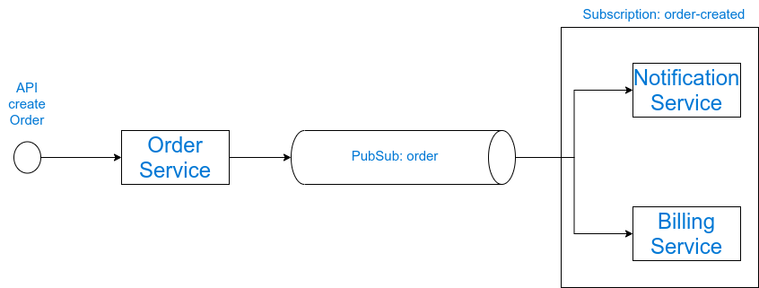
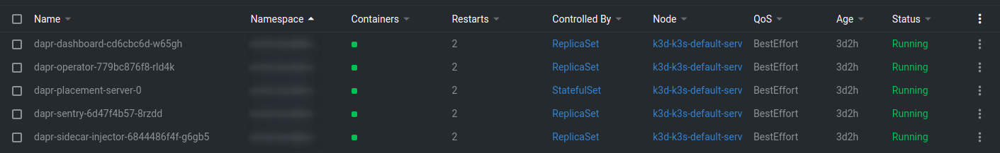
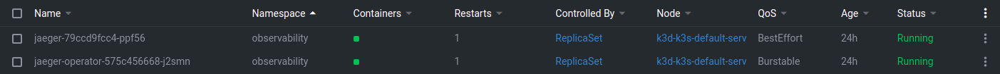
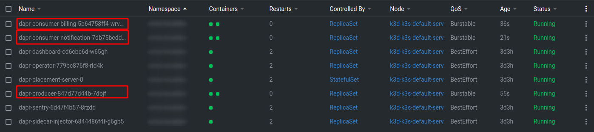
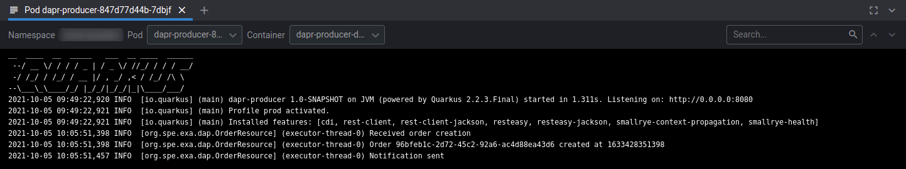
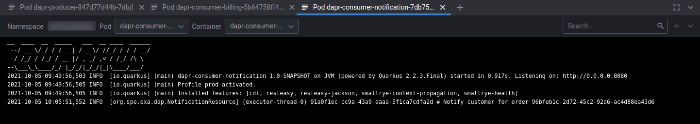
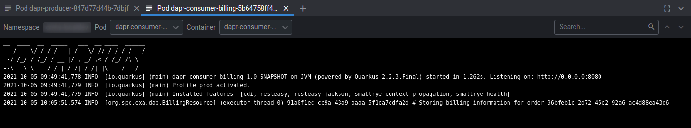
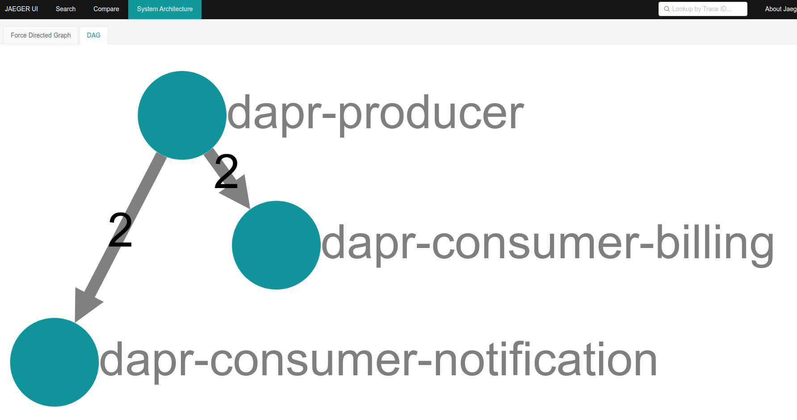
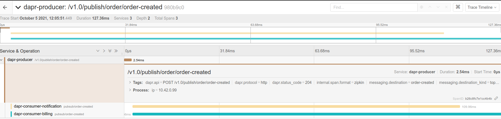
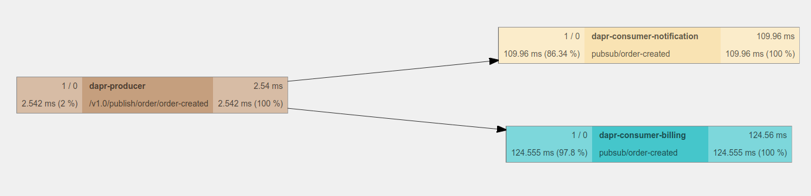

# Dapr Pub/Sub example AWS/AZURE/GCP/Redis

This repository contains a real life example of Pub/Sub using Dapr. It will show you how it is simple to switch from one pub/sub to another.

We will build a simple software with a micro-service exposing an endpoint to create an Order. This will Publish an event when the Order is Created.  Two applications will subscribe to this event, a Notification service and a Billing service.



The backends are Quarkus applications.

I am using:

- [Quarkus](https://quarkus.io) for Application development
- [jib](https://quarkus.io/guides/container-image) for image building
- [k3d](https://k3d.io) for local kubernetes cluster
- [lens](https://k8slens.dev/) as Kubernetes IDE

## Install Dapr

You need to setup Dapr on your [Kubernetes cluster](https://docs.dapr.io/operations/hosting/kubernetes/kubernetes-deploy/)

```
dapr init -k -n <namespace>
```



## Configure tracing

## Add tracing

Install Jaeger:

Procedure: https://github.com/jaegertracing/jaeger-operator

Then create the jaeger tracing:

```
kubectl -n observability apply -f k8s-resources/jaeger-tracing.yaml
```



Source: https://docs.dapr.io/operations/monitoring/tracing/supported-tracing-backends/jaeger/

Then you need to create the configuration:

```
kubectl apply -f dapr-resources/dapr-tracing-configuration.yaml
```

To access jaeger UI:

```
kubectl port-forward svc/jaeger-query 16686 -n observability
```

Then access to http://127.0.0.1:16686/jaeger/trace

## Choose your Pub/Sub middleware

To start you need to choose your Pub/Sub middleware. To do so you can go to [dapr-resources](./dapr-resources)

## Build and deploy applications

To build an deploy applications you can use:

```
./lifecycle.sh build
./lifecycle.sh deploy
```

Or you can do this on each repository.



Now let's shoot our API:

```bash
curl --location --request POST 'https://www.linkedin.com/redir/general-malware-page?url=http%3A%2F%2Forder%2e127%2e0%2e0%2e1%2enip%2eio%2Forder' \
--header 'Content-Type: application/json' \
--data-raw '{
    "total": {
        "amount": 1000,
        "currency": "EUR"
    }
}'

{
    "id": "96bfeb1c-2d72-45c2-92a6-ac4d88ea43d6",
    "creationTime": 1633428351398,
    "total": {
        "amount": 1000,
        "currency": "EUR"
    }
}
```

Let's now check the logs of our micro-services.

Producer Logs:



Consumer notification Logs:



Consumer billing Logs:



Now let's take a look to the tracing:

Topology:



Traces:


