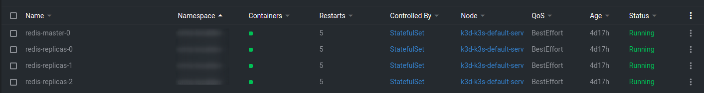
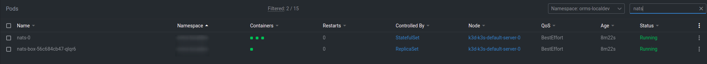
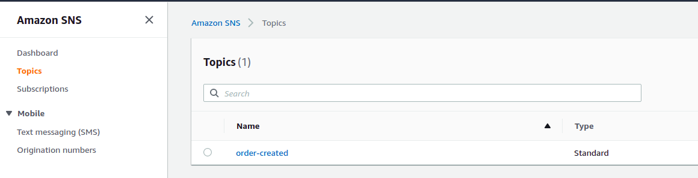
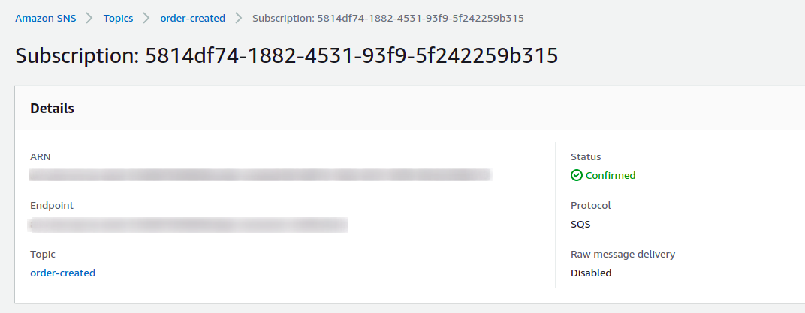
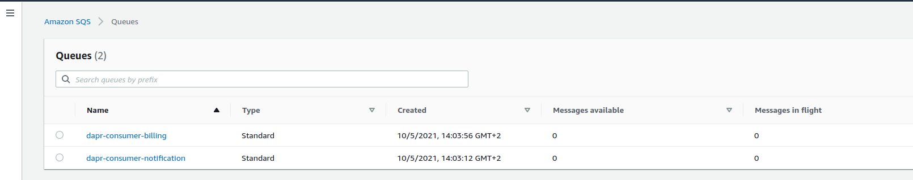
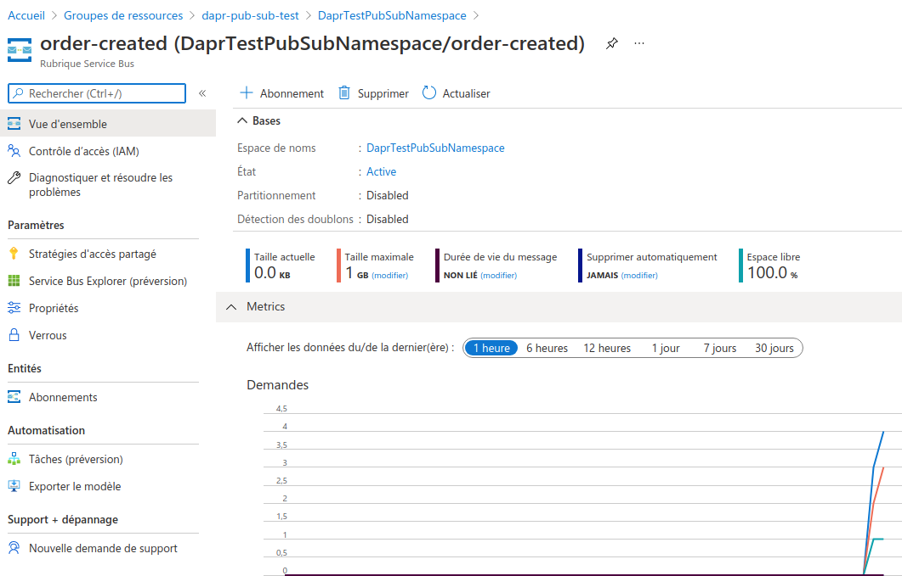
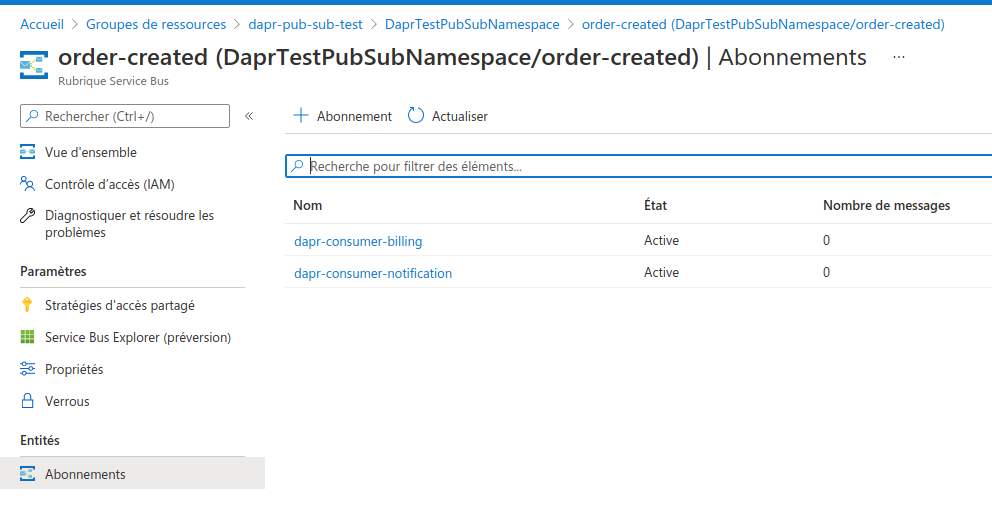
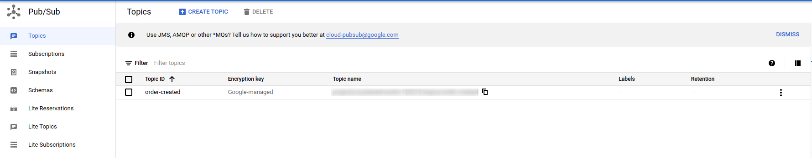
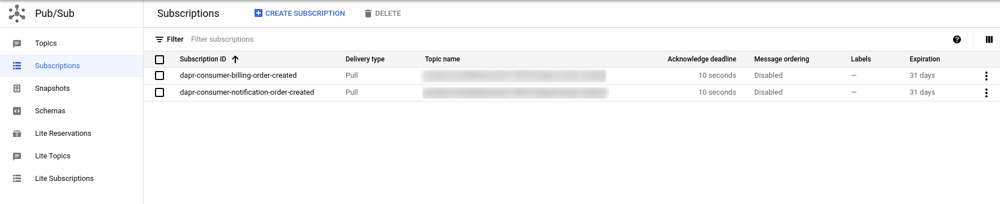

# DAPR Resources

This repository contains the resources for Dapr prototype

## Pubsub creation

To create the pubsub you can select the resource you want between:

- Redis
- Nats
- Azure Service Bus
- AWS SNS
- GCP

###  Redis

To use redis you can install redis on your namespace

```
helm repo add bitnami https://charts.bitnami.com/bitnami
helm repo update
helm install redis bitnami/redis -n <namespace>
```



Then you need to create the pubsub:

```
kubectl apply -f dapr-pubsub-order-redis.yaml
```

> Note: If your redis cluster is outside the namespace you need to configure it like this: `redis-master.<namespace>.svc.cluster.local:6379`


### Nats

To use Nats you can install Nats on your namespace

```
helm repo add nats https://nats-io.github.io/k8s/helm/charts/
helm install nats nats/nats
```



### AWS

To use you need to generate access key + secret access key with sufficient permission and then create a secret

To create user:

```bash
# Create user
aws iam create-user --user-name dapr-pub-sub-test
# Provide access key
aws iam create-access-key --user-name dapr-pub-sub-test
# {
#    "AccessKey": {
#        "UserName": "dapr-pub-sub-test", 
#        "Status": "Active", 
#        "CreateDate": "2021-10-05T11:56:11Z", 
#        "SecretAccessKey": "XXXXXXXXXXXXXXXXXXXXXXXXXXXX", 
#        "AccessKeyId": "XXXXXXXXXXXXXXXXXXXXXXXXXXXX"
#    }
# }
# Attacth sns full access + sqs full access
aws iam attach-user-policy --user-name dapr-pub-sub-test --policy-arn arn:aws:iam::aws:policy/AmazonSNSFullAccess
aws iam attach-user-policy --user-name dapr-pub-sub-test --policy-arn arn:aws:iam::aws:policy/AmazonSQSFullAccess
```

To create the secret:

```
kubectl create secret generic aws-order-secret --from-literal=access-key=<your access key> --from-literal=secret-key=<your secret key>
```

To create the pubsub:

```
kubectl apply -f dapr-pubsub-order-aws.yaml
```

When you first shoot it will create a sns topic for the pubsub and an sqs queue for the subscription(s):





### Azure Service Bus

For Azure you need to create a Service Bus

To create the service bus:

```bash
# Create Resource group dapr-pub-sub-test
az group create --location westeurope --name dapr-pub-sub-test
# Create the ServiceBus Namespace
az servicebus namespace create --location westeurope --name DaprTestPubSubNamespace --resource-group dapr-pub-sub-test
# Create the Topic
az servicebus topic create --name order --namespace-name DaprTestPubSubNamespace --resource-group dapr-pub-sub-test
# Retrieve connection informations
az servicebus namespace authorization-rule keys list --name RootManageSharedAccessKey --namespace-name DaprTestPubSubNamespace --resource-group dapr-pub-sub-test
# {
#  "aliasPrimaryConnectionString": null,
#  "aliasSecondaryConnectionString": null,
#  "keyName": "RootManageSharedAccessKey",
#  "primaryConnectionString": "XXXXXXXXXXXXXXXXXXXXXXXXXXXXXXXXXXXX",
#  "primaryKey": "XXXXXXXXXXXXXXXXXXXXXXXXXXXXXXXXXXXX",
#  "secondaryConnectionString": "XXXXXXXXXXXXXXXXXXXXXXXXXXXXXXXXXXXX",
#  "secondaryKey": "XXXXXXXXXXXXXXXXXXXXXXXXXXXXXXXXXXXX"
}
```

To create the secret:

```
kubectl create secret generic azure-order-secret --from-literal=connection-string=<primaryConnectionString>
```

To create the pubsub:

```
kubectl apply -f dapr-pubsub-order-azure.yaml
```

When The deployment is completed you might see a topic created and subscriptions :




# GCP

For GCP you need to create a service account:

```bash
# Generic for project ID creation
export PROJECT_ID=<your_project_id>
# Creates a service account
gcloud iam service-accounts create dapr-pub-sub-test \
    --description="Pub sub test service account" \
    --display-name="dapr-pub-sub-test"
# Add the iam policy pubsub admin
gcloud projects add-iam-policy-binding $PROJECT_ID \
    --member="serviceAccount:dapr-pub-sub-test@${PROJECT_ID}19.iam.gserviceaccount.com" \
    --role="roles/pubsub.admin"
# Create key
gcloud iam service-accounts keys create key-file \
    --iam-account=dapr-pub-sub-test@${PROJECT_ID}.iam.gserviceaccount.com
# Retrieve file content
cat key-file 
# {
#   "type": "service_account",
#   "project_id": "XXXXXXXXXXXXXXXXXXXXXXXXXXXXXX",
#   "private_key_id": "XXXXXXXXXXXXXXXXXXXXXXXXXXXXXX",
#   "private_key": "XXXXXXXXXXXXXXXXXXXXXXXXXXXXXX",
#   "client_email": "XXXXXXXXXXXXXXXXXXXXXXXXXXXXXX",
#   "client_id": "XXXXXXXXXXXXXXXXXXXXXXXXXXXXXX",
#   "auth_uri": "https://accounts.google.com/o/oauth2/auth",
#   "token_uri": "https://oauth2.googleapis.com/token",
#   "auth_provider_x509_cert_url": "https://www.googleapis.com/oauth2/v1/certs",
#   "client_x509_cert_url": "XXXXXXXXXXXXXXXXXXXXXXXXXXXXXX"
# }
```

Create a secret `gcp-order-secret.yaml`:

```yaml
apiVersion: v1
kind: Secret
metadata:
  name: gcp-order-secret
type: Opaque
data:
  project_id: XXXXXXXXXXXXXXXXXXXXXXXXXXX
  identity_project_id: XXXXXXXXXXXXXXXXXXXXXXXXXXX # In our case it is the same as project_id
  private_key_id: XXXXXXXXXXXXXXXXXXXXXXXXXXX
  private_key: XXXXXXXXXXXXXXXXXXXXXXXXXXX
  client_email: XXXXXXXXXXXXXXXXXXXXXXXXXXX
  client_id: "XXXXXXXXXXXXXXXXXXXXXXXXXXX"
  client_x509_cert_url: XXXXXXXXXXXXXXXXXXXXXXXXXXX
```

```
kubectl apply -f gcp-order-secret.yaml
```

To create the pubsub:

```
kubectl apply -f dapr-pubsub-order-gcp.yaml
```

When you first shoot it will create a topic for the pubsub and subscription(s):




##  Subscription

Once your pubsub is created you can create your subscription

```
kubectl apply -f dapr-subscription-order-created.yaml
```